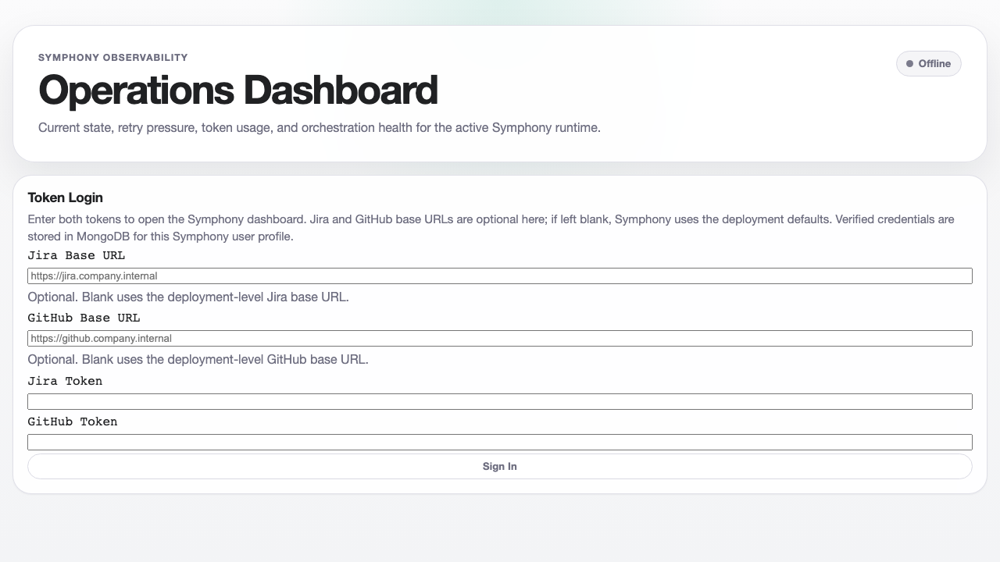
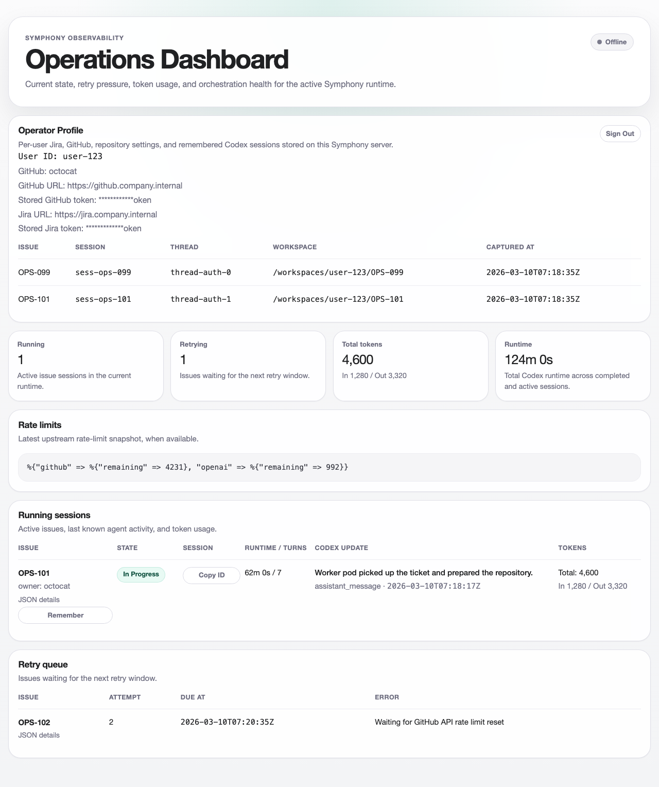

# Symphony Helm Chart

This chart runs one Symphony orchestrator pod and lets that orchestrator create one worker pod per ticket.

## How This Fork Differs From The OpenAI Reference Repo

This chart documents behavior that is specific to this fork, not to the
original OpenAI reference repo:

- The dashboard at `/` is also a login page.
- Each user logs in with both Jira and GitHub tokens.
- Jira Cloud and internal Jira URLs are supported.
- GitHub Cloud and GitHub Enterprise URLs are supported.
- User profile metadata and remembered Codex session metadata are persisted in
  MongoDB.
- Worker pods can receive per-user Jira and GitHub credentials when the Jira
  assignee matches a stored user profile.
- Kubernetes deployment is treated as the primary production path.

## What This Chart Configures

- `tracker.*` selects the ticket source.
- `tracker.endpoint` lets you point Symphony at Jira Cloud or an internal Jira base URL.
- `repository.cloneUrl` and `repository.ref` control which repo each ticket workspace clones.
- `codex.command` controls how worker pods launch Codex. The default is `codex app-server`.
- `env` injects runtime credentials into the orchestrator pod.
- `worker.inheritEnv` controls which env vars worker pods receive from the orchestrator pod.
- `mongo.*` controls how per-user Jira/GitHub/Codex session metadata is stored in MongoDB.

The dashboard login now requires both a Jira token and a GitHub token. Users enter those tokens in the UI, Symphony verifies them, and the verified profile is stored in MongoDB under a stable `user_id`.

Real Codex turns need `OPENAI_API_KEY` in `env` so the worker pod inherits it before launching `codex app-server`.

## Login And Permission Model

There are two credential scopes in this fork:

1. Deployment-level credentials
   - used by the orchestrator for tracker polling and service startup
   - examples: `JIRA_API_TOKEN`, `JIRA_BASE_URL`, `OPENAI_API_KEY`
2. User-level credentials
   - entered on the dashboard login page
   - require both Jira and GitHub or GitHub Enterprise tokens
   - persisted in MongoDB together with the user's selected server URLs

Worker pod credential selection works like this:

- Symphony checks the Jira assignee on the issue.
- If that assignee matches a stored logged-in user profile, the worker pod gets
  that user's Jira and GitHub credentials.
- If there is no match, the worker pod falls back to deployment-level env vars.

Important limitation:
- The orchestrator's tracker polling path is still driven by deployment-level
  `tracker.*` settings and env vars.
- User login credentials currently control dashboard identity, remembered
  sessions, and worker-pod credential injection. They do not yet replace the
  deployment-level Jira polling identity.

## Prerequisites

- Kubernetes cluster with outbound access to OpenAI and your Git host
- Helm 3
- A pushed Symphony image built from `/Users/chee_mac/symphony/Dockerfile`
- `OPENAI_API_KEY`
- `JIRA_API_TOKEN`
- `MONGODB_URI`
- Optional: `SYMPHONY_DEFAULT_JIRA_BASE_URL`
- Optional: `SYMPHONY_DEFAULT_GITHUB_BASE_URL`

## 1. Build And Push The Image

```bash
docker build -t registry.example.com/symphony:0.1.0 /Users/chee_mac/symphony
docker push registry.example.com/symphony:0.1.0
```

The same image is used for the orchestrator pod and the per-ticket worker pods.

## 2. Create Namespace And Secrets

```bash
kubectl create namespace symphony

kubectl -n symphony create secret generic symphony-openai \
  --from-literal=api-key="$OPENAI_API_KEY"

kubectl -n symphony create secret generic symphony-jira \
  --from-literal=api-key="$JIRA_API_TOKEN"

kubectl -n symphony create secret generic symphony-github \
  --from-literal=token="$GITHUB_TOKEN"

kubectl -n symphony create secret generic symphony-mongo \
  --from-literal=uri="$MONGODB_URI"
```

Each deployed Symphony instance uses the Jira token you inject here. The token is not baked into the image or chart.

If every user should log into the dashboard against the same Jira server, also set `SYMPHONY_DEFAULT_JIRA_BASE_URL` in the deployment env. Users can then leave the Jira URL blank at login and Symphony will use that deployment default.
If every user should log into the dashboard against the same GitHub or GitHub Enterprise server, also set `SYMPHONY_DEFAULT_GITHUB_BASE_URL`. Users can leave the GitHub URL blank and Symphony will use that deployment default.

If you pull from a private registry, create an image pull secret too and reference it from `imagePullSecrets`.

## 3. Create A Values File

Create `values-prod.yaml`:

```yaml
image:
  repository: registry.example.com/symphony
  tag: "0.1.0"
  pullPolicy: IfNotPresent

worker:
  image:
    repository: registry.example.com/symphony
    tag: "0.1.0"
    pullPolicy: IfNotPresent

tracker:
  kind: jira
  endpoint: https://jira.company.internal
  projectSlug: PLATFORM
  apiKeyEnv: JIRA_API_TOKEN

repository:
  cloneUrl: https://github.com/your-org/your-repo.git
  ref: main

runtimeServer:
  host: "0.0.0.0"
  port: 4000

mongo:
  collection: user_sessions
  poolSize: 5

env:
  - name: PORT
    value: "4000"
  - name: SYMPHONY_DEFAULT_JIRA_BASE_URL
    value: https://jira.company.internal
  - name: SYMPHONY_DEFAULT_GITHUB_BASE_URL
    value: https://github.company.internal
  - name: JIRA_API_TOKEN
    valueFrom:
      secretKeyRef:
        name: symphony-jira
        key: api-key
  - name: JIRA_BASE_URL
    value: https://jira.company.internal
  - name: GITHUB_TOKEN
    valueFrom:
      secretKeyRef:
        name: symphony-github
        key: token
  - name: GH_TOKEN
    valueFrom:
      secretKeyRef:
        name: symphony-github
        key: token
  - name: GITHUB_SERVER_URL
    value: https://github.company.internal
  - name: GITHUB_API_URL
    value: https://github.company.internal/api/v3
  - name: OPENAI_API_KEY
    valueFrom:
      secretKeyRef:
        name: symphony-openai
        key: api-key
  - name: MONGODB_URI
    valueFrom:
      secretKeyRef:
        name: symphony-mongo
        key: uri
```

Notes:

- `tracker.endpoint` should point at your Jira base URL. For Jira Cloud that is typically `https://your-domain.atlassian.net`; for internal Jira it can be something like `https://jira.company.internal`.
- `SYMPHONY_DEFAULT_JIRA_BASE_URL` becomes the login fallback when a user leaves the Jira base URL blank.
- `SYMPHONY_DEFAULT_GITHUB_BASE_URL` becomes the login fallback when a user leaves the GitHub base URL blank.
- Dashboard access requires both a Jira token and a GitHub token per user, and each token can target an internal Jira or GitHub Enterprise server.
- The orchestrator's tracker polling path is still driven by `tracker.*` plus deployment env like `JIRA_API_TOKEN`; the per-user login credentials are currently used for dashboard identity and remembered session persistence.
- Worker pods match the issue assignee against the stored Jira identity and, when they find a match, inject that user's `JIRA_BASE_URL`, `JIRA_API_TOKEN`, `GITHUB_TOKEN`, `GH_TOKEN`, `GITHUB_SERVER_URL`, and `GITHUB_API_URL`.
- `worker.inheritEnv` already includes `JIRA_BASE_URL`, `JIRA_API_TOKEN`, `GITHUB_TOKEN`, `GH_TOKEN`, `GITHUB_SERVER_URL`, `GITHUB_API_URL`, `OPENAI_API_KEY`, `OPENAI_BASE_URL`, and `OPENAI_ORG_ID`.
- If you change `tracker.apiKeyEnv`, make sure the matching env var is present in `env`.
- If workers need extra credentials, add the env var to both `env` and `worker.inheritEnv`.
- The default `after_create` hook will use `GITHUB_TOKEN` for HTTPS clone when the repository host matches `GITHUB_SERVER_URL`, which supports private GitHub Enterprise repositories.
- `MONGODB_URI` should include the database name Symphony will use for user-scoped session persistence.
- `mongo.collection` defaults to `user_sessions`.
- User-specific Jira/GitHub/Codex session metadata is now persisted in MongoDB instead of local disk.

## 4. Install Or Upgrade

```bash
helm upgrade --install symphony /Users/chee_mac/symphony/charts/symphony \
  --namespace symphony \
  --create-namespace \
  -f values-prod.yaml
```

## 5. Verify The Deployment

Check the orchestrator pod:

```bash
kubectl -n symphony get pods
kubectl -n symphony logs deploy/symphony -f
```

Check the dashboard and JSON API:

```bash
kubectl -n symphony port-forward deploy/symphony 4000:4000
curl http://127.0.0.1:4000/api/v1/state
curl http://127.0.0.1:4000/api/v1/session
```

When you open `http://127.0.0.1:4000/`, the first page should be the login form.
In this fork, that is expected behavior. Users must sign in with:

- Jira token
- GitHub token
- Optional Jira base URL
- Optional GitHub or GitHub Enterprise base URL

If the optional base URL fields are left blank, Symphony uses `SYMPHONY_DEFAULT_JIRA_BASE_URL` and `SYMPHONY_DEFAULT_GITHUB_BASE_URL`. If no GitHub default is set, Symphony falls back to `https://github.com`.

Example login screen from a live k3s deployment:



After login, operators see their stored profile, remembered sessions, and active runtime state in the dashboard:



Worker pods appear only when the Jira tracker returns an active issue:

```bash
kubectl -n symphony get pods -w
```

## Infra-Only Smoke Test

If you only want to validate Kubernetes wiring without depending on Jira data, deploy the same chart with `tracker.kind=memory` and keep the same `OPENAI_API_KEY` and repo settings. That validates the orchestrator pod, worker pod image, and real Codex execution path independently from Jira.
